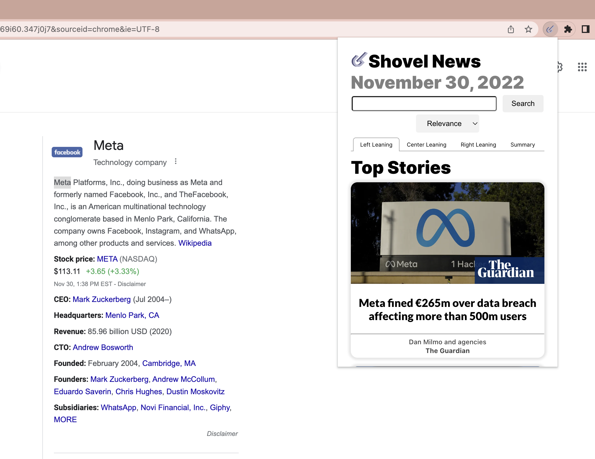

# Shovel

Shovel is a chrome extension that provides users with the ability to highlight text and find relevant articles and more background context.

## Prerequisites

Node.js, npm, Python3, pip3, yarn, NewsAPI account at `https://newsapi.org/`

## Set Up

To set up our application, there are a few steps.

### Chrome Extension

cd into `client` folder

Run `yarn run build`

In a chrome browser, go to: chrome://extensions/

In this website, click on `load unpacked` and upload the build folder from the `client` folder.

### Server

cd into `server` folder

In the `.env` file, replace `MY_API_KEY` with your personal API key from NewsAPI https://newsapi.org/

Run `npm i nodemon && npm start`. You can check if this server works at the port you define: (ex: localhost:8081)

### Backend - Python

cd into `backend` folder

Run `pip3 install -r requirements.txt` or `pip install -r requirements.txt` (depends on the version of Python you have installed). This will allow you to download all of the relevant packages for NLP processing.

Run `python3 -m nltk.downloader all` or `python -m nltk.downloader all` (depends on the version of Python you have installed). If you get an SSL Certificate error, refer to troublshooting below. This downloads pre-trained data from the NLP algorithm.

Run `python3 app.py` or `python app.py` (depends on the version of Python you have installed) to start the server. You can check if the server works at the port you define (ex: localhost:8000).

## Usage

Go to any article online or page online. Highlight a portion of text. Note that due to limitations from  NewsAPI, not all queries will return articles. In this case, try hightlighting simpler phrases or less text overall.


Now, we want to click on the chrome extension and receive the relevant articles. You can toggle the sort by options to best meet your needs.



## Testing 

To run the tests, run `yarn test` or `yarn test-c` (coverage) in any directory.

## COMMON ERRORS TROUBLESHOOTING:

If you have other active extensions (particularly adblockers), you might need to disable them.

If you have just updated the extension in developer tools, you need to reload/refresh any page you are going to use the extension on. As a general practice, after loading the `build` folder into `chrome://extensions/`, you should refresh the page you return to. 

### SSL Certificate: 

In command line, run `python3` or `python` (depends on the version of Python you have installed).

Run in the command line:
```
import nltk
import ssl

try:
    _create_unverified_https_context = ssl._create_unverified_context
except AttributeError:
    pass
else:
    ssl._create_default_https_context = _create_unverified_https_context

nltk.download()
```

You should see a windows pop-up with options to download certain packages. Proceed to download all packages, and exit. 
